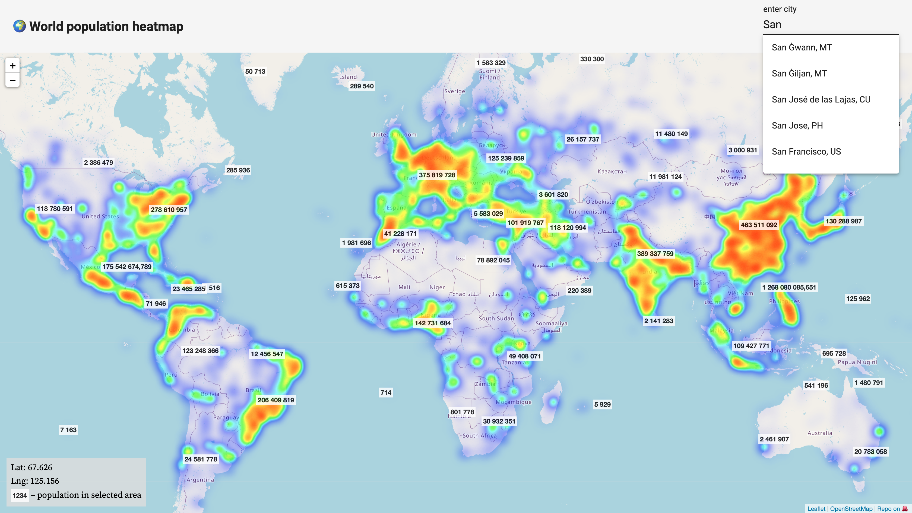

# Population

World population heat map

- Data was retrieved from this [dataset](https://public.opendatasoft.com/explore/dataset/geonames-all-cities-with-a-population-1000/information/)
- Frontend is hosted on [vercel.com](https://vercel.com/)
- Backend is hosted on [glitch.com](https://glitch.com/) with [json-server](https://github.com/typicode/json-server/)

## Demo

[](https://population.vercel.app/)

## How to run

1. Run `npm install` for both `frontend` and `backend` directories
2. Start local backend server:

    ```bash
    $ cd backend
    $ json-server db.json
    ```

3. Update path for local backend in GeoData service:

    ```js
    private apiUrl = 'http://localhost:3000/';
    ```

4. Start angular app

    ```bash
    $ cd frontend
    $ ng serve
    ```
